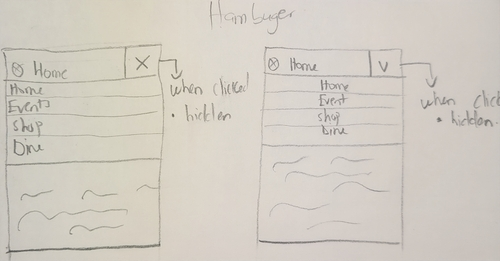

# Project 3: Design Journey

**For each milestone, complete only the sections that are labeled with that milestone.** Refine all sections before the final submission.

You are graded on your design process. If you later need to update your plan, **do not delete the original plan, leave it in place and append your new plan _below_ the original.** Then explain why you are changing your plan. Any time you update your plan, you're documenting your design process!

**Replace ALL _TODOs_ with your work.** (There should be no TODOs in the final submission.)

Be clear and concise in your writing. Bullets points are encouraged.

Place all design journey images inside the "design-plan" folder and then link them in Markdown so that they are visible in Markdown Preview.

**Everything, including images, must be visible in _Markdown: Open Preview_.** If it's not visible in the Markdown preview, then we can't grade it. We also can't give you partial credit either. **Please make sure your design journey should is easy to read for the grader;** in Markdown preview the question _and_ answer should have a blank line between them.


## Existing Project (Milestone 1)

**Tell us about the project you'll be using for Project 3.**

### Project (Milestone 1)
> Which project will you add interactivity to enhance the site's functionality?

Project 2


### Audience (Milestone 1)
> Briefly explain your site's audience. (1-2 sentences)
> Be specific and justify why this audience is a **cohesive** group.

My sites Audience will be college students living in Ithaca. Based on the interview I conducted , the junior from Ithaca College and the Sophomore from Cornell University are both College students with a similar goal for attending the festival. They all loves apples and every thing thing apples and that made them show up tat the festival to explore the various varieties of apples available and explore other things as well.


### Audience's Goals (Milestone 1)
> List the audience's goals that you identified in Project 1 or 2.
> Simply list each goal. No need to include the "Design Ideas and Choices", etc.
> You may adjust the goals if necessary.

- Buy apples and other Products made from apples.
- Explore the available options at the festival
- Entertainment and food
- Socialization
- Adventure
- Relaxation


## Interactivity Design (Milestone 1)

### Modal Interactivity Brainstorm (Milestone 1)
> Using the audience goals you identified, brainstorm possible options for **modal** interactivity to enhance the functionality of the site while also assisting the audience with their goals.
> Briefly explain each idea and provide a brief rationale for how the interactivity enhances the site's functionality for the audience. (1 sentence)
> Note: You may find it easier to sketch for brainstorming. That's fine too. Do whatever you need to do to explore your ideas.

- A modal on the event page for the event schedule
This is relevant to my users because they they will get a detailed view the festival schedule, including the timing for the various events and performances.
- A modal on the home page
This modal is also relevant to my users because it will provide them with a detailed answers of all the frequently asked questions people that attend the festival normally ask.
- A on the TransitGuide page for the list of tcat buses
This is relevant to my users especially people that use their own cars and wolud prefer to come to the festival via the Tcat buses. This modal will give my users a detailed insight of the bus schedules.


### Interactivity Design Ideation (Milestone 1)
> Explore the possible design solutions for the interactivity.
> Sketch at least two iterations of the modal and at least two iterations of the hamburger menu interactivity.
> Annotate each sketch explaining what happens when a user takes an action. (e.g. When user clicks this, something else appears.)





### Final Interactivity Design Sketches (Milestone 1)
> Create _polished_ sketch(es) (it's still a sketch, but with a little more care taken to communicate ideas clearly to the graders) to plan your interactivity.
> **Sketch out the entire page where your interactivity will go.**
> Include your interactivity to the sketch(es).
> Add annotations to explain what happens when the user takes an action.
> Include as many sketches as necessary to communicate your design (ask yourself, could another 1300 take these sketches an implement my design?)

**Modal design sketches:**


**Hamburger drop-down navigation menu design sketches:**


### Interactivity Rationale (Milestone 1)
> Describe the purpose of your proposed interactivity.
> Provide a brief rationale explaining how your proposed interactivity addresses the goals of your site's audience.
> This should be about a paragraph. (2-4 sentences)

The purpose of implementing modals for list of tcat buses and a hamburger menu for the narrow version of the page on the Apple Festival website is to enhance user experience, especially for our college student audience. The modals for the list of buses aim to provide quick and detailed view of the bus schedule during the days of the festival to aid transportation. College students, often looking for fast information, will appreciate this streamlined approach, enabling them to access event details efficiently. The hamburger menu, a common mobile navigation pattern, ensures easy navigation and compactly organizes website sections on narrower screens. It caters to the mobile browsing habits of college students, who are frequently accessing websites via smartphones.


## Interactivity Implementation Plan (Milestone 1)

### Interactivity Planning Sketches (Milestone 1)
> Produce planning sketches that include all the details another 1300 student would need to implement your interactivity design.
> Your planning sketches should include _all_ HTML elements needed for the interactivity; _annotations_ for the element types, their unique IDs, and CSS classes; and lastly the initial CSS classes.

**Modal planning sketches:**


**Hamburger drop-down navigation menu planning sketches:**


Revision to final design


### Interactivity Pseudocode Plan (Milestone 1)
> Write your interactivity pseudocode plan here.
> Pseudocode is not JavaScript. Do not put JavaScript code here.

**Modal pseudocode:**

Open the modal:

```
When #buttonA is clicked(event)
remove .hidden form #bus-modal(action)
```

Close the modal:

```
When #buttonB is clicked(event)
add .hidden to #bus-modal(action to be taken)
```

**Hamburger menu pseudocode:**

Pseudocode to show/hide (toggle) the navigation menu (narrow screens):

```
- To show nav-menu
When #button1 is clicked(event)
remove .hidden from #ham-nav(action to be taken)

- To hide nav-menu
When #button2 is clicked(event)
add .hidden to #ham-nav(action to be taken)
```

Pseudocode to hide the hamburger button and show the navigation bar when the window is resized too wide:

```
When width of #nav-bar > 600px(event)
add .hidden to #button 1
remove .hidden from #nav-bar
```

Pseudocode to show the hamburger button and hide the navigation menu when the window is resized too narrow:

```
When width of #nav-bar < 600px(event)
add .hidden to #ham-nav
remove .hidden from #button1
```


## Grading (Final Submission)

### Interactivity Usability Justification (Final Submission)
> Explain how your design effectively uses affordances, visibility, feedback, and familiarity.
> Write a paragraph (3-5 sentences)

Visibility:
My modal is centerd making it prominent and easy to notice and my hambuyer menu's position is familiar to my users.
Afforedances:
My hamburger icon is a button and my modal looks like a dialog box, which makes it clear to users that they can interact with it.
Familiarity:
My modal and hamburger menu follow general the design pattern and functionality.
Feedback:
When users interact with buttons, an action occures giving them feedback.

### Tell Us What to Grade (Final Submission)
> We aren't re-grading your Project 1 or 2.
> We are only grading the interactivity you added.
> Tell us where (what pages) we can find your interactivity and how to use it.
> **We will only grade what you list here;** if it's not listed, we won't grade it.

-The hamburger menu
-Modal on the TransitGuide page


### Collaborators (Final Submission)
> List any persons you collaborated with on this project.

Myself with the help of the TA's


### Reference Resources (Final Submission)
> Please cite any external resources you referenced in the creation of your project.
> (i.e. W3Schools, StackOverflow, Mozilla, etc.)

- Mozillia Documentation
- w3schools
- Infoo 1300 Document (Javascript snippets)


### Self-Reflection (Final Submission)
> This was the first project in this class where you coded some JavaScript. What did you learn from this experience?

It was a bit challenging for me but the snipppets were very helpful.


> Take some time here to reflect on how much you've learned since you started this class. It's often easy to ignore our own progress. Take a moment and think about your accomplishments in this class. Hopefully you'll recognize that you've accomplished a lot and that you should be very proud of those accomplishments!

I'm not very very proud of my since I thought I could have done better, but in general I have lernt a lot especially woth interactivity.
